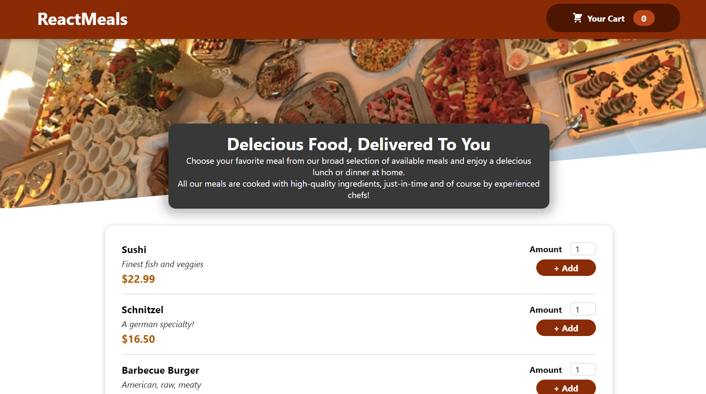
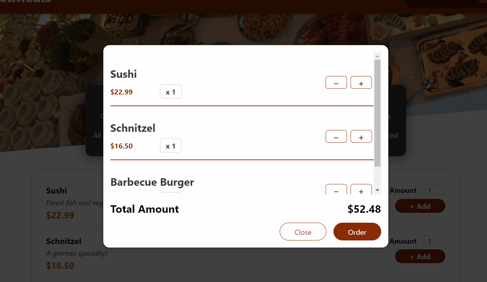

# reactMeal
##  ReactMeal

## AIM OF THE PROJECT

### I mastered:

- [x] CSS Modules;
- [x] useContext hook;
- [x] useEffect hook;
- [x] useState hook;

[demo](https://serhiisergio.github.io/reactMeal/)

### SCREENSHOTS

## STRUCTURE OF THE PROJECT

This project consists of a root component `App.js` which contains several components with their css styles. You can write your blog, save it, and delete it.

Go up to the [Header](#header) !
